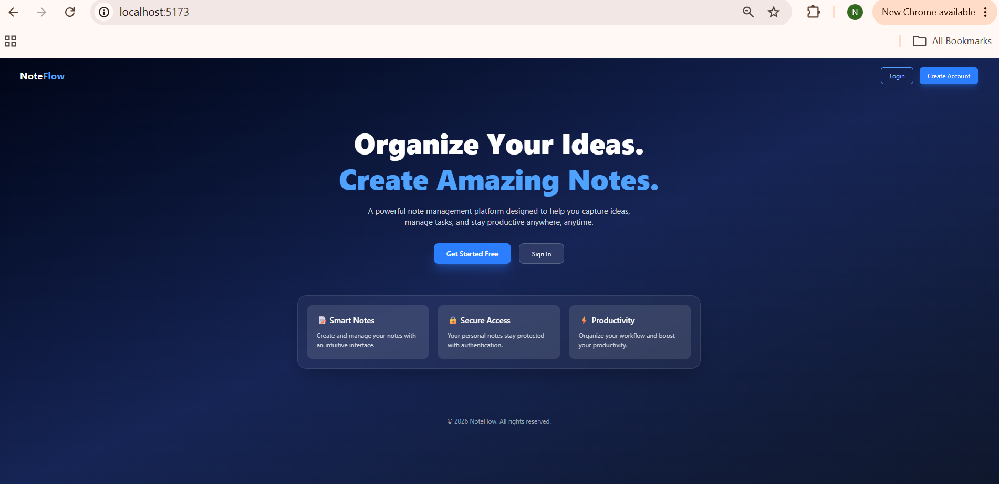
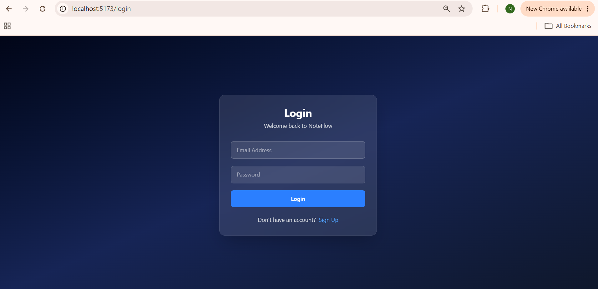
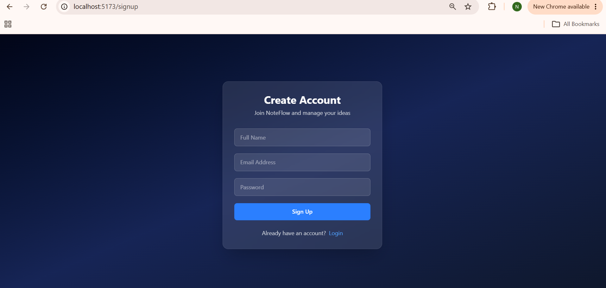
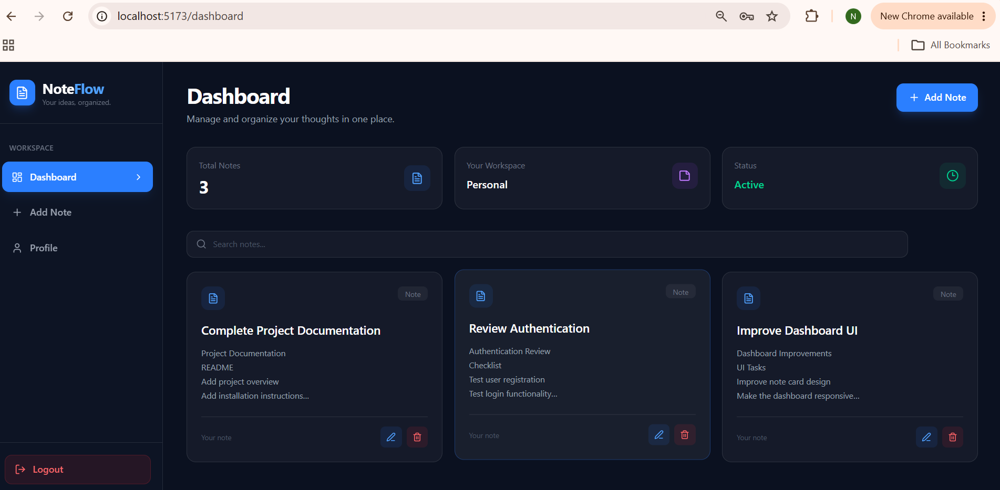
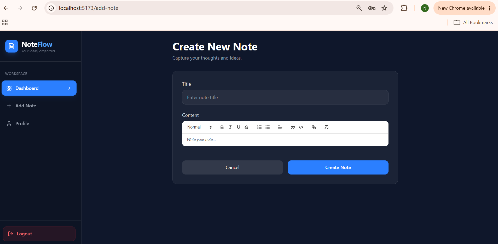
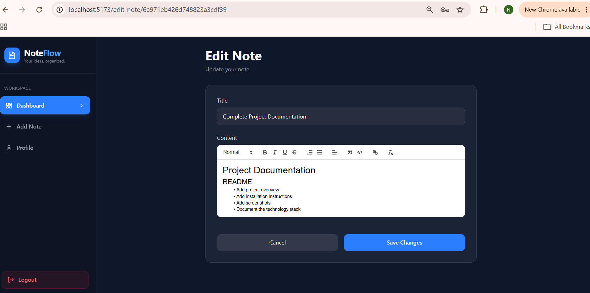
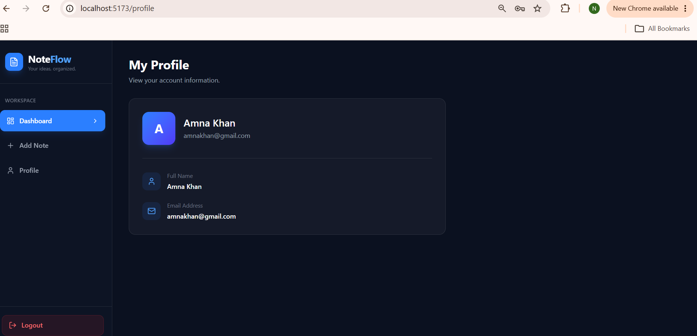

# Note Taking Application

## A full-stack note-taking platform built on the MERN stack, featuring secure authentication, rich-text note editing, and a responsive interface.

## Table of Contents

- [Overview](#overview)
- [Features](#features)
- [Tech Stack](#tech-stack)
- [Prerequisites](#prerequisites)
- [Project Structure](#project-structure)
- [Installation](#installation)
- [Environment Variables](#environment-variables)
- [Running the Application](#running-the-application)
- [Testing](#testing)
- [Application Screenshots](#application-screenshots)
- [Security Notes](#security-notes)
- [Author](#author)

---

## Overview

This application allows users to register, log in, and manage personal notes through a clean, distraction-free interface. Authentication is handled with JSON Web Tokens, notes support rich-text formatting, and users can search, filter, and organize their content with ease.

**Project identifier:** `cohort-9-mern-9541-amna`

The repository is organized into two independent applications:

| Folder     | Description                                                    |
| ---------- | -------------------------------------------------------------- |
| `Frontend` | React application built with Vite and styled with Tailwind CSS |
| `Backend`  | REST API built with Express and MongoDB                        |

---

## Features

- User registration and login secured with JWT-based authentication
- Passwords hashed using bcrypt before storage
- Session handling via HTTP cookies
- Create, edit, and delete notes
- Search and filter notes by keyword or criteria
- Rich-text note editor with formatting support
- User profile view and management
- Toast notifications for real-time user feedback
- Responsive layout across desktop and mobile devices

---

## Tech Stack

**Frontend**

| Technology       | Purpose                              |
| ---------------- | ------------------------------------ |
| React 19         | UI library                           |
| Vite             | Build tool and dev server            |
| React Router DOM | Client-side routing                  |
| Tailwind CSS     | Styling                              |
| Axios            | HTTP requests                        |
| React Quill      | Rich-text editing                    |
| jwt-decode       | Reading token payloads on the client |
| Lucide React     | Icon set                             |

**Backend**

| Technology         | Purpose                         |
| ------------------ | ------------------------------- |
| Node.js            | Runtime environment             |
| Express 5          | Web framework and routing       |
| MongoDB & Mongoose | Database and ODM                |
| jsonwebtoken       | Authentication tokens           |
| bcrypt             | Password hashing                |
| cookie-parser      | Cookie handling                 |
| CORS               | Cross-origin request handling   |
| dotenv             | Environment variable management |
| Pino               | Application logging             |

---

## Prerequisites

Before setting up the project, ensure the following are installed:

- Node.js (v18 or later recommended)
- npm (installed with Node.js)
- A MongoDB database (local instance or a MongoDB Atlas cluster)
- Git

---

## Project Structure

```
cohort-9-mern-9541-amna/
│
├── Frontend/
│   ├── src/
│   ├── package.json
│   └── ...
│
├── Backend/
│   ├── index.js
│   ├── .env
│   ├── package.json
│   └── ...
│
└── README.md
```

---

## Installation

**1. Clone the repository**

```bash
git clone https://github.com/AmnaKhan2003/cohort-9-mern-9541-amna
cd cohort-9-mern-9541-amna
```

**2. Install frontend dependencies**

```bash
cd Frontend
npm install
```

**3. Install backend dependencies**

```bash
cd ../Backend
npm install
```

All required dependencies are declared in the respective `package.json` files and will be installed automatically.

---

## Environment Variables

Create a `.env` file inside the `Backend` directory with the following keys:

```env
PORT=5000
MONGO_URI=your_mongodb_connection_string
JWT_SECRET=your_jwt_secret_key
JWT_EXPIRE=600s
NODE_ENV=development
```

| Variable     | Description                                               |
| ------------ | --------------------------------------------------------- |
| `PORT`       | Port the backend server listens on                        |
| `MONGO_URI`  | Connection string for the MongoDB database                |
| `JWT_SECRET` | Secret key used to sign and verify authentication tokens  |
| `JWT_EXPIRE` | Expiration duration for issued tokens (e.g. `600s`, `1d`) |
| `NODE_ENV`   | Application environment (`development` or `production`)   |

The `.env` file is not included in version control and must be created manually before running the backend.

---

## Running the Application

The frontend and backend run as separate processes and should each be started in their own terminal.

**Backend**

```bash
cd Backend
npm run dev
```

**Frontend**

```bash
cd Frontend
npm run dev
```

By default:

- The frontend is served at `http://localhost:5173`
- The backend API is served at `http://localhost:5000` (or the port configured in `.env`)

---

## Testing

**Frontend tests (Jest)**

```bash
cd Frontend
npm run test
```

**Backend tests (Mocha & Chai)**

```bash
cd Backend
npm run test
```

---

## Application Screenshots

### Homepage



### Login



### Signup



### Dashboard



### Add Note



### Edit Note



### User Profile



---

## Security Notes

- Never commit the `.env` file or any real credentials to version control; confirm `.env` is listed in `.gitignore`.
- Use separate MongoDB users and databases for development and production environments.
- Rotate the `JWT_SECRET` and database credentials periodically, and immediately if they are ever exposed.
- Share credentials with team members or clients only through a secure channel, not in code, chat, or documentation.

---
